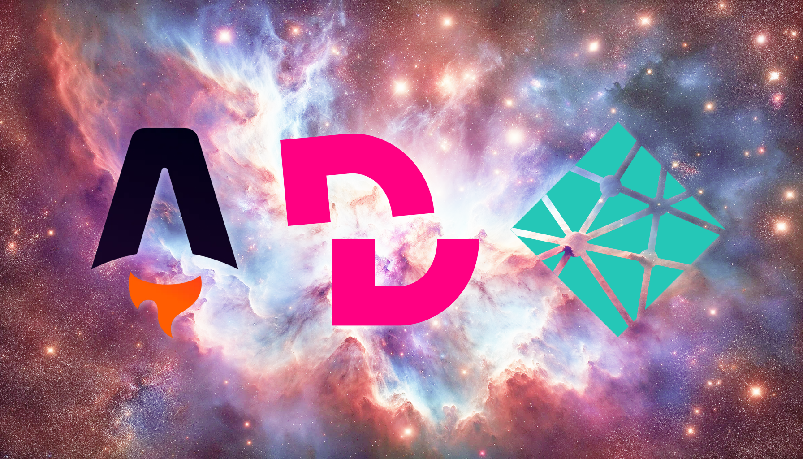

Chez Image IN, nous avons un long passé avec GatsbyJS. Néanmoins, depuis le rachat de Gatsby Inc par Netlify, il est évident que la technologie ne séduit plus. Les plugins mettent de plus en plus de temps à se mettre à jour, le volume de recherche s’effondre, bref, le framework se meurt.

## Astro, le petit nouveau qui fait trembler les vieux

Il nous fallait songer à un remplaçant, un nouveau framework de coeur sur lequel baser notre toolbox afin d’itérer rapidement. Après un rapide benchmark, nous nous sommes donc orienté vers [Astro](https://astro.build/), désormais dans sa quatrième version.

Astro est encore un petit acteur dans l’écosystème à côté des mastodonte que sont Next et Nuxt, donc pourquoi ce choix ? Parce qu’Astro est incroyablement absolu dans sa volonté d’optimiser les performances, et c’est exactement ce que nous recherchons.

Par défaut, Astro, c’est rendu statiquement, sans javascript !

Les images sont optimisées automatiquement avec un plugin intégré nativement, il y a un support markdown, un routage dynamique et une CLI très performante qui permet d’intégrer les plugins très rapidement.

Aussi, Astro est “UI-agnostic” ! Ce qui veut dire que vous pouvez faire des composants React, Vue, Svelte, etc selon vos goûts personnels 🤌

## DecapCMS, rendre le markdown user-friendly

Nous, on aime le Markdown ! C’est simple à écrire, c’est léger, ça permet de se passer de base de données jusqu’à un certain volume que de nombreux sites n’atteignent jamais. Bref, c’est une solution élégante pour répondre avec efficacité à de nombreux besoins.

Mais nos utilisateurs, eux, ils détestent ! Quand ils ne réagissent pas en mode “C’est qui ça Marc Downe ?” la simple évocation d’un langage de balisage leur donne des démangeaisons. Ils ne nous paient pas pour “coder”, ils veulent des formulaires comme sur Wordpress.

[DecapCMS](https://decapcms.org/), c’est tout simplement ça. C’est un petit CMS, anciennement nommé NetlifyCMS, permettant d’éditer ses markdown sans faire de markdown.

Aussi, et c’est justement ce qui nous intéresse, DecapCMS est gitbased ! Ce qui veut dire que vous modifiez vos markdown sur une interface en ligne et lorsque vous sauvegardez (ou lancez un redeploy), ça build votre site statique. Le tout fonctionne sans base de données, sans serveur à proprement parler, tout est cloud.

## Un petit problème de compatibilité

A l’heure où nous parlons, un problème subsiste. Nous n’arrivons pas à nous servir du package npm de DecapCMS avec Astro et des composants React. Le problème semblerait apparemment lié à Vite et Storybook, néanmoins, après quelques heures de tentatives, nous avons abandonné l’idée de nous en servir.

A la place, nous avons choisi d’utiliser l’installation via le CDN, qui fonctionne très bien après quelques ajustement, mais c’est une petite frustration que nous espérons voir disparaître aux prochaines mises à jour.

## Github et Netlify pour le déploiement

Le top de cette stack, c’est qu’en un rien de temps, le site peut être en ligne et prêt à être utilisé. Notre code est versionné sur Github, comme une grande partie des projets informatiques du monde entier. Celui-ci est alors récupéré par [Netlify](https://www.netlify.com/), build et mis en ligne automatiquement à chaque push.

Et ça se paramètre en quelques minutes, on ne parle pas d’un Jenkins !

## Un peu de style dans tout ça ?

L’occasion de revoir notre stack en profondeur nous a amené à se poser la question du framework CSS. 🤔

On aime le style fait main, mais soyons réaliste, quel temps perdu pour si peu de valeur ! C’est qu’il en faut du temps pour concevoir une UI qui soit accessible et stable sur tous les navigateurs et tailles d’écrans !

Bootstrap ou Material ? Mouais, trop gros. Au delà de toute considération de développeur sur l’aspect développement, ça ne répond pas à notre volonté de faire du light et performant.

[Tailwind](https://tailwindcss.com/) alors ? C’est ce qu’on s’est dit. L’avantage de tailwind, c’est son “Just In Time” mode qui permet de ne générer que le css nécessaire pour le site. Et ça, chez Image IN, on aime.

Ce qu’on aime moins, c’est Tailwind…

Si Tailwind a été une révolution en son temps, permettant d’aller encore un peu plus loin dans la philosophie full components et à des dev full stack de faire du CSS sans en faire réellement, on regrette énormément sa maintenabilité dans le temps.

Alors, quelle est l’étape suivante ? [Tamagui](https://tamagui.dev/) ? Peut-être bien ! Ce sera l’occasion d’un prochain article 👌