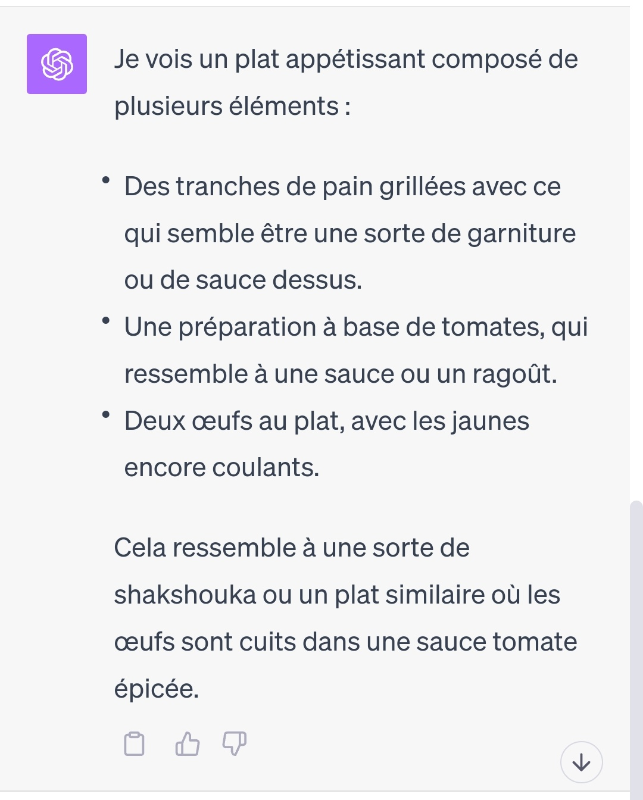

import Row from '../components/row/row';
import Col from '../components/col/col';
import Stack from '../components/stack/stack';
import Button from '../components/button/button';

Ces derniers temps, les intelligences artificielles n’arrêtent plus de nous surprendre et il semble même que le mouvement accélère. La semaine dernière nous vous faisions part de nos expérimentations sur Dall-E 3. Cette semaine, il est temps de s’essayer à ChatGPT Vision en essayant de lui faire coder un site internet à partir d’un dessin.

## C’est quoi ChatGPT Vision ?

ChatGPT Vision sont les yeux de ChatGPT. Pendant longtemps on a regretté que l’IA conversationnelle d’Open AI était dénuée d'yeux. Et bien maintenant, elle en a. OpenAI a sorti sa nouvelle version optimisée de ChatGPT en France le 12 octobre. Il est désormais possible d’uploader des images dans le chat et l’IA sera capable de vous la décrire avec une certaine précision.

## Les premiers essais avec des images

Lors de mon premier test, j’étais en train de déjeuner et je lui ai envoyé une photo de mon repas. L’IA a du premier coup su reconnaitre qu’il s’agissait d’une assiette de Shakchouka. Avez-vous déjà essayé de décrire une assiette de Shakchouka ? C’est un plat qui n’est pas forcément très connu et qui n’est pas le plus photogénique ou identifiable. Et bien l’IA a su le faire.

<Row>
  <Col xs={12} md={6}>
    
  </Col>
  <Col xs={12} md={6}>
    
  </Col>
</Row>

Dans un second temps j’ai voulu le mettre un peu plus à l’épreuve en lui faisant résoudre un sudoku. Si l’IA a bien reconnu la grille, elle a eu du mal à la recopier correctement de manière textuelle et encore plus à la résoudre. Au final, j’ai fini mon sudoku seul.

Je lui ai aussi montré une partition de musique. L’IA a reconnu qu’il s’agissait d’une partition, mais n’a pas su l'analyser. Elle n'était pas très complexe, je ne sais pas vraiment si c'est un bridage volontaire de la part d'OpenAI ou si l'IA n'est pas encore capable de le faire. Je pense personnellement qu'elle était tout à fait capable de lire les notes de cette partition et de les retranscrire en texte. Mais je me dis que pour des raisons de droits d'auteur, il est peut-être préférable de ne pas le faire.

## Faire un site internet à partir d’un dessin

Il y a quelques semaines, j’avais vu quelqu’un, je ne sais plus s’il s’agit d’une personne d’OpenAI ou d’une autre entreprise, générer un site internet via une maquette de site internet faite sur papier. Vision était l’occasion rêvée de tester ce genre de fonctionnalité.

C’est donc ce que j’ai fait. Armé d’un fidèle Bic bleu, j’ai tracé sur un bout de papier qui trainait le splash screen d’un site internet, on peut le dire, très généraliste. Littéralement rien de plus qu’une page d’accueil, un blog et une page contact.

### Quelques informations supplémentaires dans le prompt

Afin de l’aider un peu, j’ai ajouté quelques informations supplémentaires dans le prompt pour lui indiquer ce que je voulais faire de cette image. Notamment je lui ai donné quelques specs techniques:

- Utiliser React
- Utiliser TailwindCSS
- Utiliser Lorem Picsum en terme de placeholder pour les images
- Générer des titres et des descriptions pour les articles de blog

Et là, stupéfaction !

Cette Homepage est très imparfaite, disons même carrément moche, mais les éléments sont à leur place et correctement nommés par rapport à ce que j’ai demandé. ChatGPT a parfaitement compris que je voulais une herobanner, un titre, un sous-titre, une grille de 4 colonnes avec des cards, etc.

## Coder un site entier avec ChatGPT Vision

Qu’on se le dise, rapidement je me suis aperçu que l’IA avait du mal à suivre au fur et à mesure des itérations. Elle mettait du temps à répondre et plantait souvent. Alors, maintenant que je n’avais plus besoin de ses yeux, j’ai ouvert un nouveau chat pour finir le travail.

Je voulais aller jusqu’au bout de l’exercice: séparer correctement les fichiers, mettre en place un routeur et un blog "fonctionnel". En soit, une utilisation assez classique de ChatGPT sans les fonctions de vision à proprement parler à partir du moment où la maquette a été traduite en code.

Et je dois dire que le dialogue s’est passé globalement sans encombre. Au final je ne serais intervenu personnellement que deux fois. Une fois pour faire fonctionner le routeur et une autre pour régler un problème d’affichage avec tailwind qui pour je ne sais quelle raison lui échappait.

Le résultat final ? Regardez par vous même !

<Stack direction="horizontal" position="center" className="mb-2">
  <Button className="reverse" as="a" href="https://chatgptvisionwebsite.image-in.net/" target="_blank">Voir le site</Button>
</Stack>

Nous avons rapidement mis ce site en ligne afin que vous puissiez le voir dans son jus et constater le travail accompli par le chatbot. Que l’on soit d’accord, oui, c’est moche, oui, c’est un site qui ne sert à rien. Mais que l’on soit clair, c’est un site fait par une IA (qui plus est bridée), à partir d’une photo de maquette faite en une minute sur un bout de papier au bic bleu.

Lorsque j'ai communiqué les résultats sur twitter, si la majorité partageait mon enthousiasme, une personne en l'occurence a eu une réaction agressive envers l'expérience. "C'est un template moche et inutile, ça ne sert à rien !" je vous résume de manière polie. C'est vrai, c'est moche et inutile, mais c'est un site fait par une IA à partir d'un dessin. C'est un peu comme si on disait que le premier avion était inutile parce qu'il ne pouvait pas voler plus de 100 mètres. C'est un premier pas, un début, une preuve de concept. Et c'est déjà énorme.

## Est-ce que ChatGPT Vision peut remplacer un développeur ?

Pour répondre à cette question ? Actuellement, non, c’est une véritable chèvre. A vrai dire, si le développement du site s’est bien passé, c’est parce qu’en tant que développeur, j’avais constamment l’oeil sur ce qu’il faisait et je lui faisais des demandes précises sur la suite.

Et même en étant derrière, le résultat reste en demi teinte. Le site est quand même très laid et certaines évidences ne lui apparaissent pas. Par exemple, j’ai du lui préciser qu’il fallait mettre des liens dans la barre de navigation…

Le métier concerne bien plus de compétences que d’écrire quelques lignes de code et les IA mettront encore quelques années avant de nous mettre au chômage, rassurez-vous. Je serais curieux de voir s’il est ne serait-ce que possible d’aller jusqu’à la mise en production du site avec quelqu’un sans connaissance de développeur aux commandes ?

### Un bon assistant pour tout le monde

Néanmoins c’est un outil supplémentaire permettant d’accroitre notre productivité et il y a encore des centaines de tests à faire afin de découvrir l’étendu de ses capacités. Les progrès dans le domaine de l’intelligence artificielle sont hallucinants et il y a fort à parier que de nombreux métiers vont lourdement évoluer dans les années à venir.

Ne serait que d'un point de vue accessibilité, la capacité de ChatGPT a décrire fidélement les images pourrait devenir un atout majeur pour les personnes malvoyantes. Il est déjà possible de faire lire un site internet par un navigateur, mais il est encore impossible de décrire les images sans balise alt. C'est un exemple parmi tant d'autres des possibilités offertes par ChatGPT Vision.

## Les améliorations à venir de ChatGPT

Si on devait faire une demande de fonctionnalité, de notre côté, on souhaiterait qu’il se dote de bon goût. Artistiquement il est globalement assez mauvais, que ce soit en webdesign, en écriture ou en génération d’image. Globalement, ce qu’il fait est toujours assez cliché et/ou d’un goût douteux. Heureusement pour les métiers de la création diront nous. Les entreprises avides ne louperaient pas l'occasion de remplacer leurs employés et prestataires par un IA à moindre coût si celle-ci s'avérait être un peu plus créative, les métiers artistiques ont encore un peu de répit.

### Bientôt l'audio et la vidéo dans ChatGPT

Il parait que les prochaines mises à jour concerneront l’audio et la vidéo, ce qui augmentera encore le domaine des possibles. Poser des questions à l’oral, analyser une vidéo sans la regarder soi-même, montrer des effets visuels et lui demander de les reproduire en code, etc. le potentiel est infini.

En conclusion, nous sommes assez impressionnés d'avoir réussi à créer ce petit site internet à partir d'un schéma sur papier grâce à ChatGPT Vision. Nous confirmons par cet exercice qu'il a de bons yeux, bien plus performants que ce que nous avions eu l'occasion de tester en terme d'OCR avant.