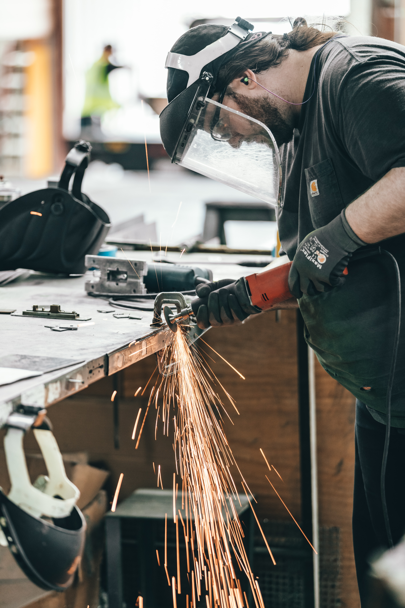

import Row from "../components/row/row";
import Col from "../components/col/col";

Dans un monde numérisé, la visibilité en ligne est cruciale pour toute entreprise, y compris pour les artisans. La création de site internet pour artisan est votre passerelle vers une vitrine digitale efficace, elle vous permet non seulement de présenter votre savoir-faire, mais aussi de toucher une clientèle plus large. Dans ce guide, nous explorerons les avantages d'avoir un site web en tant qu'artisan, les coûts associés et comment Image IN peut être votre partenaire de choix dans cette aventure digitale.

<Row>
  <Col xs={6}>
    
  </Col>
  <Col xs={6}>
    
  </Col>
</Row>

## Les avantages d’avoir un site internet pour un artisan

### Gagner en crédibilité: faire de la preuve sociale

L'exemple d'Adapt Habitat illustre parfaitement cet avantage. Suite à notre intervention, le site adapthabitat.fr est devenu une vitrine professionnelle valorisant leur expertise en douches sécurisées pour seniors. Les témoignages client mis en avant ont renforcé la confiance des visiteurs, humanisant l'entreprise.

### Être plus visible des clients

Un site bien optimisé est votre allié pour une visibilité accrue. Adapt Habitat a bénéficié d’un site léger, performant sur mobile, un atout SEO majeur.

Le SEO, c’est l’art de se faire aimer de Google. Avec des mots-clés judicieusement choisis, le site d’Adapt Habitat est devenu plus visible, attirant une audience qualifiée.

Un bon SEO rapproche de vos clients. En simplifiant, il positionne votre site en haut des recherches, là où vos futurs clients vous cherchent.

## Combien ça coute un site internet pour artisan ?

La création d'un site internet pour un artisan peut varier en fonction de nombreux facteurs tels que la complexité du site, le nombre de pages, et les fonctionnalités spécifiques requises. Voici un aperçu des tarifs observés sur le marché :

- Les tarifs peuvent débuter aux alentours de 500 euros et s'envoler vers 1 500 euros ou plus pour des prestations plus complètes[1](https://www.artisandubatiment.fr/trouver-chantiers/site-internet-artisan/#:~:text=Prix%20d%E2%80%99une%20cr%C3%A9ation%20de%20sites,les%20prestations%20les%20plus%20compl%C3%A8tes).
- Un site vitrine pour un professionnel indépendant est souvent tarifé entre 400 € et 2 000 €, tandis qu'un site internet professionnel complet peut se facturer entre 800 € et 5 000 €[2](https://blog.simplebo.fr/combien-coute-creation-site-internet-professionnel#:~:text=Pour%20vous%20donner%20un%20ordre,%E2%82%AC%20et%205%20000%20%E2%82%AC).
- Les estimations varient largement, avec des projets allant de 1 000 € à 100 000 €, reflétant la diversité des besoins et des prestataires sur le marché[3](https://reestart.com/prix-site-internet/#:~:text=Ces%20estimations%20sont%20bas%C3%A9es%20sur,freelances%20et%20des%20agences%20web).

Chez Image IN, nous proposons une offre à 250€/mois pendant un an, soit un total de 3000€. Ce tarif inclut la conception, l'hébergement, la maintenance de votre site, ainsi qu'un shooting photo professionnel et la création du branding si nécessaire. Cette offre est particulièrement compétitive, surtout en considérant que le site vous appartient une fois le paiement effectué, contrairement à de nombreuses offres qui fonctionnent sur un modèle de location. Sur une période de 10 ans, l'investissement initial avec Image IN est très avantageux.

Valorisez votre artisanat avec un site web professionnel. Découvrez notre [offre exceptionnelle](/votre-site-a-250-euros-par-mois-pendant-1-an/) pour les artisans désireux de se distinguer sur le marché digital.

## Pourquoi Image IN est une bonne solution pour mon site internet ?

### Site internet performants (Web Vitals)

Chez Image IN, l'efficacité de votre site est notre priorité. Nous nous appuyons sur les standards des Web Vitals pour concevoir des sites rapides et réactifs. En simple, imaginez un site qui s'ouvre quasi instantanément sur n'importe quel appareil, c'est ce que nous visons.

Un site performant c'est comme une boutique bien rangée, les clients aiment y passer du temps et reviennent souvent. Et Google le remarque aussi, améliorant ainsi votre position dans les résultats de recherche.

### Mise en place de stratégie SEO

SEO, ou l'art d'être bien vu par Google, est au cœur de nos préoccupations. Nous élaborons des stratégies sur-mesure pour propulser votre site en haut des recherches liées à votre métier. C'est comme avoir une enseigne lumineuse dans la rue la plus passante de la ville, mais en ligne.

Nos méthodes éprouvées de SEO attirent non seulement plus de visiteurs, mais assurent que ces visiteurs sont intéressés par vos services. C'est un chemin tracé directement vers votre porte, dans le monde digital.

### Rentabilité à terme

Investir dans un site avec Image IN, c'est opter pour la rentabilité sur le long terme. L'alliance d'un site performant et d'une stratégie SEO solide transforme votre site en un outil puissant pour attirer et convertir des clients.

Au fil du temps, l'augmentation de la visibilité et des conversions réduit le coût d'acquisition de nouveaux clients, faisant de votre site une machine autonome de génération de business.

Avec Image IN, votre site devient un investissement judicieux qui continue de porter ses fruits, année après année. Nos solutions sont conçues pour vous aider à vous démarquer et à prospérer dans votre domaine d'artisanat.

<Row>
  <Col xs={12}>
    
  </Col>
</Row>

## Faire un site internet soi-même gratuitement

Créer un site internet par soi-même peut sembler séduisant, surtout avec la multitude de plateformes gratuites disponibles. Toutefois, cette approche présente des inconvénients majeurs.

Un site web doit être bien construit, tant au niveau du design que de la technique, pour captiver et retenir l'attention des visiteurs. De plus, sans connaissance en SEO, le site risque de rester invisible sur la toile, car les moteurs de recherche ne le mettront pas en avant.

La gestion du temps est un autre facteur clé. La création et la maintenance d'un site peuvent consommer une quantité significative de temps, temps qui pourrait être investi dans votre métier.

En fin de compte, un site fait maison sans expertise professionnelle peut vous coûter plus cher en temps et en opportunités manquées, malgré l'absence de coûts initiaux.

## J’ai déjà un site internet, comment faire une refonte ?

La refonte d’un site internet n’est pas simplement une affaire de changement esthétique. C’est une démarche complexe qui, bien menée, peut propulser votre entreprise à un niveau supérieur en ligne.

Un **plan de redirection** est crucial lors de cette étape. Il s'agit d'un plan qui assure que les visiteurs arrivant sur vos anciennes pages seront automatiquement redirigés vers les nouvelles. Cela évite des pages d'erreur, une expérience frustrante pour l'utilisateur, et préserve la réputation de votre site aux yeux de Google.

Retrouver les identifiants pour le nom de domaine est également primordial si vous souhaitez conserver votre adresse web actuelle. Cela semble simple, mais sans ces identifiants, la transition vers votre nouveau site peut se compliquer.

Chez Image IN, nous sommes équipés pour gérer chaque aspect de la refonte, assurant une transition fluide vers un site plus performant et attrayant, tout en conservant l’essence et la valeur de votre marque. Notre approche holistique assure que votre site refondu ne sera pas seulement beau, mais aussi techniquement solide et prêt à capturer et convertir plus de visiteurs en clients fidèles.

## Est-ce que mon site internet pour artisan peut être rentable ?

Investir dans un site internet conçu par Image IN est une démarche réfléchie visant la rentabilité et la croissance de votre activité artisanale. Voici comment les finances se décomposent sur le long terme :

### Première année : Mise en place et lancement

- **Coût de l'offre Image IN :** 250€/mois sur 12 mois, soit un total de 3 000€. Ceci couvre la conception, l'hébergement et la maintenance de votre site.
- **Stratégie SEA :** 150€/mois pour la publicité en ligne, soit 1 800€ sur l'année.
- **Pack SEO :** 3 articles SEO à 120€ pour les 6 premiers mois, soit 720€.

**Total de l'investissement la première année :** 5 520€.

### Années suivantes : Entretien et croissance

- **Coût d'hébergement et de maintenance avec Image IN :** 50€/mois, soit 600€/an.
- **Stratégie SEA :** Maintien du budget à 150€/mois, soit 1 800€/an.

À partir de la deuxième année, votre site est déjà en place et l'investissement nécessaire pour le maintenir en ligne et continuer à attirer du trafic est nettement réduit.

**Total annuel à partir de la deuxième année :** 2 400€.

### Retour sur investissement (ROI)

La rentabilité de votre site se mesure par les conversions générées. Un site bien optimisé, soutenu par des campagnes SEA ciblées et un contenu SEO pertinent, attirera des clients potentiels. Avec le temps, le coût d'acquisition par client diminue, tandis que le trafic organique et les conversions augmentent.

Un site réalisé par Image IN, enrichi par des campagnes SEA et une stratégie SEO solide, se positionne comme un outil de croissance durable. Au bout d’un an, et plus encore avec le temps, l'investissement dans votre site commence à porter ses fruits, réduisant les coûts d'acquisition et augmentant la visibilité et les conversions.

Cette dynamique engendre un cercle vertueux où chaque euro investi dans la création de site internet pour artisan vous rapproche d’une présence en ligne autonome financièrement, tout en boostant la notoriété et les affaires de votre entreprise artisanale.