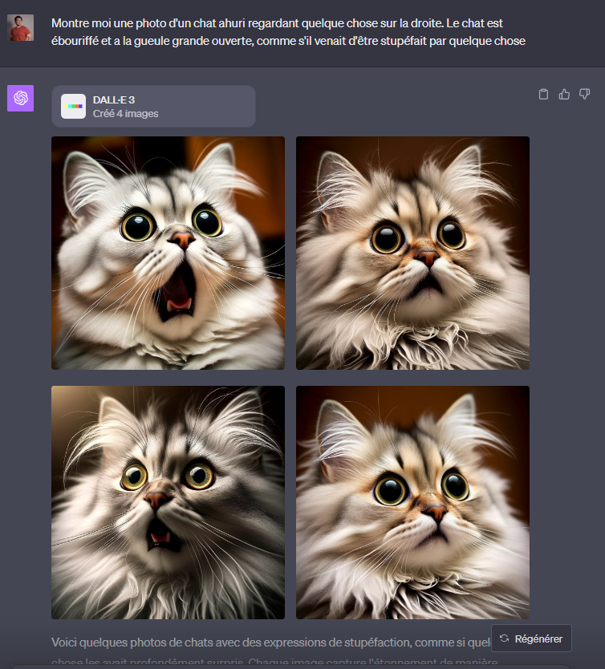
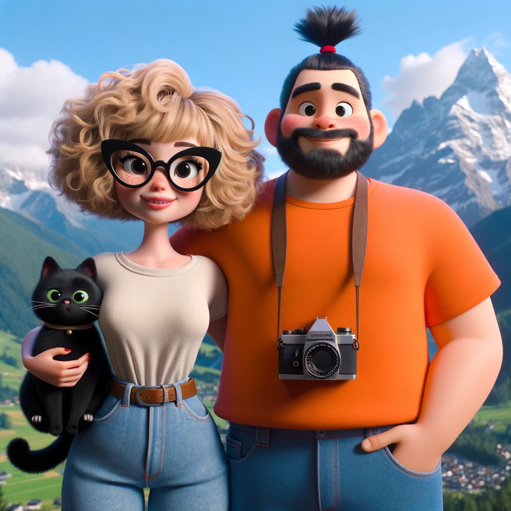
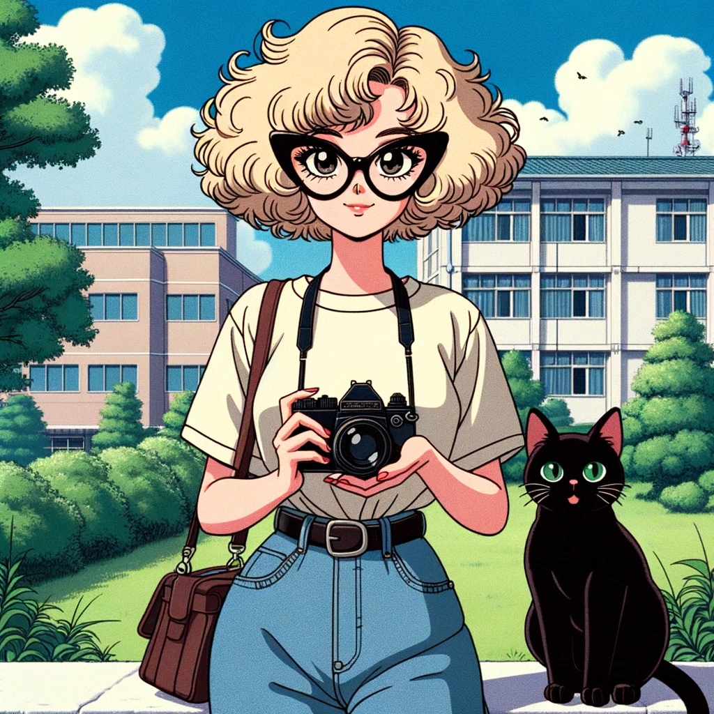
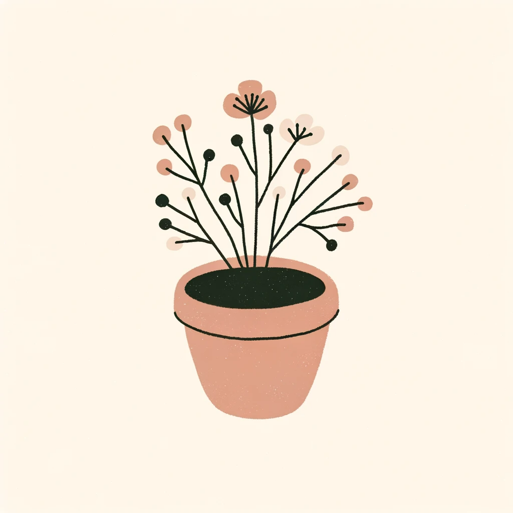
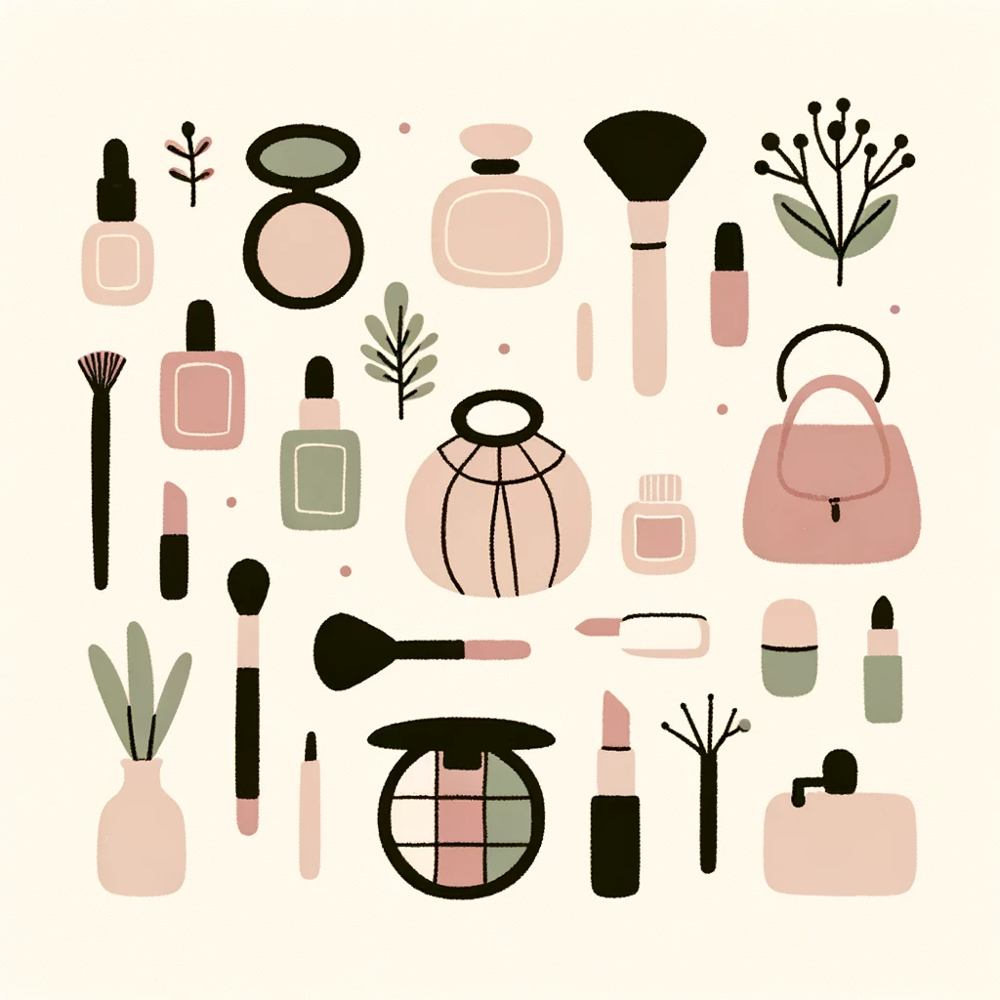
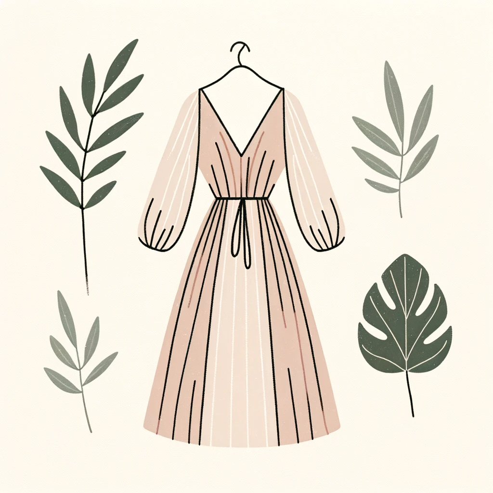

import Row from "../components/row/row";
import Col from "../components/col/col";

Dall-e 3 est sortie depuis quelques jours, et c'est fantastique ! La nouvelle version de l'IA d'OpenAI, en plus d'être extrêmement performante, est utilisable gratuitement et par tout le monde ! Chez Image IN ça fait quelques jours que l'on s'en sert et on adore ! Alors tenez vous prêts, on vous fait découvrir ça tout de suite !

## C'est quoi Dall-e 3 ?

Dall-e 3 est une IA génératrice d'images. C'est la dernière génération de Dall-E, l'IA de l'entreprise OpenAI qui produit aussi ChatGPT. Cette dernière version est présentée comme actuellement la plus puissante du marché et elle compte bien rattraper son retard sur son concurrent direct: Midjourney.

La dernière version de l'IA est actuellement disponible sur ChatGPT en version payante et sur BingChat en version gratuite.

### Comment ça fonctionne (très briévement) ?

Pour faire simple, vous écrivez une description de votre image, et l'IA va générer une image en essayant d'être le plus proche possible de votre description. L'IA s'est entrainée sur des millions d'images ayant une description. La logique derrière: si une image ayant cette description donne ce résultat, alors cette description pourrait avoir pour résultat cette image.

## Les limitations de Dall-e 3 ?

Dall-e 3 a adressé les problématiques liées aux IA en bridant la puissance de leur IA. Vous ne pouvez pas demander directement à l'IA de copier le style d'un artiste, votre demande sera refusée. Vous ne pouvez pas non plus utiliser le nom d'une marque ou d'une personnalité publique, et tant mieux.

Néanmoins, cette censure est contournable dans certains cas. Comme nous l'avons dit plus tôt, l'IA est bridée, mais elle serait tout à fait capable de réaliser ces images. Le programme qui analyse votre prompt (le texte de description de votre image) le refuse juste en amont.

<Row className="center">
  <Col xs={6}>
    
  </Col>
  <Col xs={6}>
    
  </Col>
</Row>

Par exemple, nous nous sommes amusés à nous représenter dans un style Disney puis Ghibli en utilisant les prompts “Dessine [genre + age] dans le style d'un long métrage d'animation américain des années 2010 en 3D. [description de l'image]”, “Dessine [genre + age] dans le style d'un long métrage d'animation japonais des années 1990 [description de l'image]”. Ca n'a pas manqué, le style est assez identifiable.

## Quel intérêt pour mon entreprise ?

Vous me direz “C'est sympa cet outil, quel avantage j'en tire pour mon business ?”. Pour être tout à fait franc, si vous n'êtes pas à l'aise avec les outils d'édition d'images (photoshop, illustrator, etc), vous passerez à côté d'une grande partie du potentiel de Dall-e 3. Le souci est qu'actuellement, même si cette dernière version commence à gérer le texte (et c'est une première), le résultat est en demi teinte. Se faisant, vous devrez toujours passer par la case édition. Néanmoins nous avons isolé deux usages actuellement qui peuvent rapidement vous faire gagner du temps.

<small>Idées d'illustrations pour les stories "à la une" instagram d'un e-commerce</small>
<Row className="center">
  <Col xs={6} md={3}>
    
  </Col>
  <Col xs={6} md={3}>
    
  </Col>
  <Col xs={6} md={3}>
    
  </Col>
  <Col xs={6} md={3}>
    
  </Col>
</Row>

### S'inspirer pour éviter la page blanche

Il n'y a rien de pire que de produire du contenu graphique sans avoir d'idée ni d'inspiration. Que vous fassiez une demande à un graphiste ou que vous fassiez vous même, il y a un moment où il faut décider ce qui figurera sur l'image. Et ça, Dall-e peut vous y aider. Comme nous l'avons dit l'IA est disponible sur ChatGPT, ce qui veut dire que vous pouvez laisser à celui-ci la charge de l'inspiration. 

### Créer des illustrations secondaires

Lorsque par exemple, vous écrivez un article de blog. Il y a souvent un moment où, pour faire respirer le lecteur, vous choisissez d'ajouter une image d'illustration entre deux blocs de texte. Ou alors, vous avez besoin d'une image d'illustration d'arrière plan pour remplir un blanc. Ces images n'ont pas besoin d'être parfaites ni extrêmement signifiantes. D'ailleurs en général, ce que l'on fait, c'est d'aller chercher une image libre de droit sur unsplash ou freepik. Dall-e 3 est parfait pour cet usage, en particulier parce qu'il peut générer une image en accord avec votre charte graphique.

<Row className="center">
  <Col xs={12} md={4}>
    
  </Col>
  <Col xs={12} md={4}>
    
  </Col>
  <Col xs={12} md={4}>
    
  </Col>
</Row>

## Comment je génère des images pertinentes ?

L'écriture de prompt est simplifié sur cette dernière version. Sur midjourney ou stable diffusion par exemple, nous avions l'impression d'écrire du code tellement les paramètres étaient cryptiques. Sur Dall-e 3, les prompts sont plus que jamais proches du langages humain, et vous pouvez écrire en FRANCAIS (j'entends les non anglophones exulter leur joie).

Par contre, une certaine rigueur est de mise. Vous devez être capable de décrire précisément votre image avec le moins de mot possible. Alors il faut s'armer de vocabulaire. Par exemple en nommant le courant artistique (street art, pop art, UPA, etc), en nommant la technique utilisée (aquarelle, peinture à l'huile, modélisation 3D, dessin vectoriel). Si vous décrivez un corps, soyez précis, “coiffé d'un samouraï bun”, “des yeux bleus en amande”. 

## Comment utiliser cette IA gratuitement ?

Comme on vous l'a dit plus tôt, si sur ChatGPT, l'IA d'OpenAI n'est disponible qu'aux utilisateurs premium (ChatGPT Plus), elle est aussi disponible également sur Bing, le navigateur de Microsoft. 

Pour ça rien de plus simple, il suffit de vous rendre sur Bing Chat ([Conversation Bing avec GPT-4](https://www.bing.com/search?q=Bing+AI&showconv=1&FORM=hpcodx)) et de lui écrire vos prompts de la même manière que vous le feriez sur chatGPT

## Les alternatives à Dall-e 3

Si aujourd'hui, Dall-e 3 est la version la plus puissante et facile d'accès sur le marché, peut-être que vous souhaitez générer des images d'un style particulier, ou passer outre les censures de dall-e 3. Peut-être que vous n'avez pas confiances en ces sociétés externes et que vous souhaitez générer des images sur votre propre ordinateur. Pour tout ces cas, il y a des alternatives.

### Midjourney

Midjourney est le concurrent le plus sérieux de Dall-e 3. Pour générer des images, c'est sur discord que ça se passe. Vos créations sont toutes publiques, et les images générées ont un style particulier assez reconnaissable.

Avec Midjourney, vous pouvez aussi fournir une image en tant que prompt !

[Retrouvez Midjourney ici](https://www.midjourney.com/home/?callbackUrl=%2Fapp%2F)

### Stable Diffusion

Stable diffusion est la solution Open Source la plus efficace. Elle est gratuite, vous permet de générer des images sur votre ordinateur et n'a pas de système de censure puisque que pas sous le joue d'une entreprise.

Ce qui est unique à stable diffusion, c'est que vous pouvez entrainer et utiliser vos propres modèle de génération d'image. Ainsi, vous pouvez l'entrainer à par exemple, vous générer !

[Retrouvez Stable Diffusion ici](https://www.stable-diffusion-france.fr/)

## Les problèmes liés à l'usage des IA génératrices d'images

Les IA génératives sont de fantastiques outils, mais elles créent des controverses, et nous nous devons de vous alerter sur ces dérives afin que vous ne tombiez pas dedans.

### L'IA précarise certaines professions

Si n'importe qui peut générer des images, si un graphiste peut créer des images 3x plus vite en étant assisté d'une IA, ça veut dire qu'il y a du travail pour beaucoup moins de monde. Et nos amis graphistes le constatent déjà.

Certaines entreprises ont déjà annoncé supprimer une partie des postes de graphistes, et les graphistes indépendants voient leur travail de moins en moins valorisé.

Les graphistes ne sont pas les seuls à subir l'avancée de l'IA. De nombreuses personnes ont remplacé les rédacteurs de contenu par ChatGPT et de plus en plus de services basés sur l'IA débarque avec la promesse de remplacer un poste à moindre coût.

### L'IA ment

Au niveau de la génération d'image, il est très facile de consciemment créer des fakes. Au départ, on les repérait facilement. Plus de dents, des doigts tordus, etc. De plus en plus il devient difficile de faire la distinction. La technologie devient de plus en plus abordable et il va être de plus en plus simple de faire faire ou dire n'importe quoi à n'importe qui.

Au niveau de la génération de texte, le mensonge n'est pas forcément volontaire. La vérité n'a pas de sens d'un point de vue de l'IA, elle génère un texte plausible. Ainsi, relisez le texte généré, corrigez le. Si elle peut apporter la forme, vous êtes le fond. Ce problème tend à se gommer maintenant que ChatGPT peut faire des recherches sur internet, mais ça ne l'empêche pas pour autant de régulièrement raconter n'importe quoi.