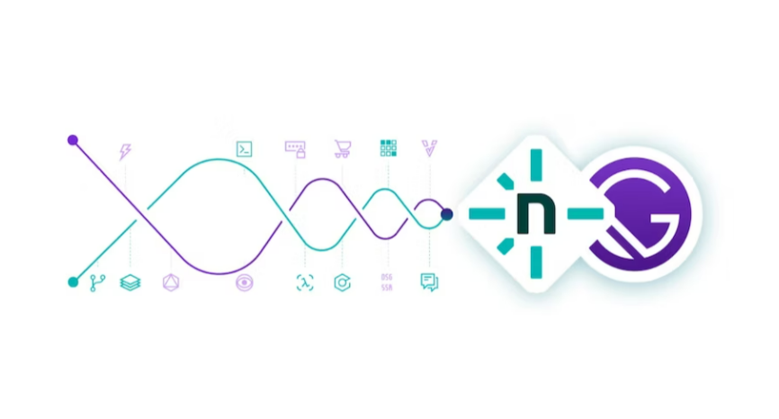
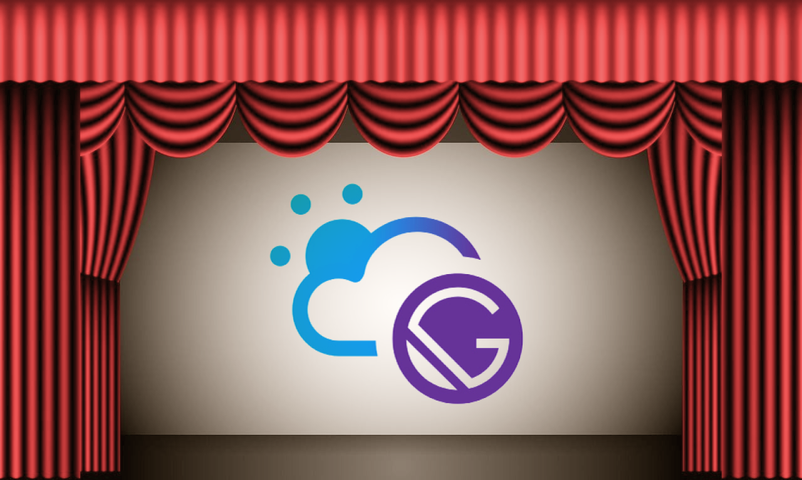
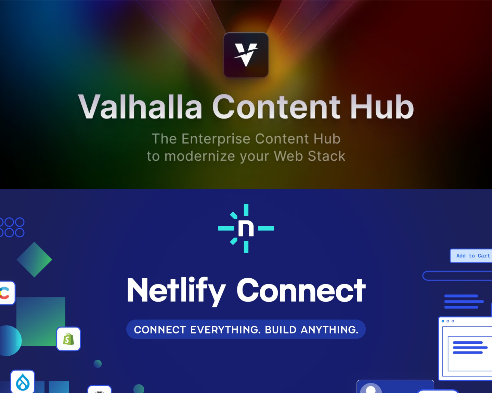

**Gatsby Cloud**, l'une des plateformes phares pour le déploiement de sites basés sur le framework **GatsbyJS**, fermera officiellement ses portes demain, le 29 septembre 2023. Suite à l'acquisition de **Gatsby Inc** par **Netlify**, la décision de ne pas maintenir deux plateformes cloud au sein d'une même entreprise était attendue. Bien que cette fermeture soit logique d'un point de vue stratégique, elle marque la fin d'une ère pour de nombreux développeurs et entreprises qui ont fait confiance à Gatsby Cloud. Alors que la communauté se prépare à cette transition, il est essentiel de se pencher sur l'héritage de Gatsby Cloud et d'explorer les alternatives disponibles pour les utilisateurs actuels. Dans cet article, nous aborderons ces sujets et jetterons un regard sur l'avenir du déploiement de sites GatsbyJS.

## Netlify et Gatsby Inc: Une fusion stratégique

### Netlify : L'ascension d'une plateforme cloud

**Netlify** s'est distingué comme un acteur majeur dans le développement web moderne. En novembre 2021, l'entreprise a marqué un tournant en levant 105 millions de dollars, portant sa valorisation à 2 milliards de dollars. Cet investissement a préparé le terrain pour des mouvements stratégiques.

L'acquisition de **OneGraph**, une plateforme **GraphQL**, a renforcé son offre pour les développeurs. Mais le coup de maître a été le rachat de **Gatsby Inc**. Comme nous l'avions détaillé dans notre analyse sur [l'acquisition de Gatsby Inc par Netlify](https://image-in.net/blog/netlify-acquiert-gatsby-inc/), cette manœuvre a consolidé la position de Netlify dans l'écosystème **Jamstack** et a conduit à des décisions majeures, dont la fermeture imminente de **Gatsby Cloud**.

Cette stratégie d'acquisition montre la détermination de Netlify à offrir des solutions innovantes à sa communauté de développeurs.

### Gatsby Inc : L'entreprise derrière le framework GatsbyJS

**Gatsby Inc**, fondée en 2015, a été le pilier du framework open-source GatsbyJS, offrant aux développeurs une plateforme pour créer des [sites web rapides et optimisés pour le SEO](https://image-in.net/blog/comment-gatsbyjs-peut-il-aider-a-ameliorer-la-velocite-de-votre-site/). L'entreprise a connu un succès notable, levant 15 millions de dollars en 2019 lors d'un tour de financement de série A.

Cependant, l'évolution rapide du développement web a vu **Next.js**, avec son intégration étroite à Vercel et l'adoption de **Turbopack**, gagner en popularité. La simplicité d'utilisation de Next.js, combinée à la rapidité de build offerte par Turbopack, a séduit de nombreux développeurs, mettant Gatsby Inc dans une position délicate.

Cette dynamique a conduit à l'acquisition stratégique de Gatsby Inc par **Netlify** en 2023, marquant la fin de Gatsby Cloud et une nouvelle étape pour l'écosystème **Jamstack**.

### L'acquisition : Une stratégie pour rivaliser avec Vercel et Next

Dans le paysage évolutif du développement web, l'acquisition de **Gatsby Inc** par **Netlify** marque une étape stratégique. À mon sens, cette manœuvre vise à contrer la montée de **Vercel** et **Next.js**. En intégrant **GatsbyJS**, Netlify se positionne comme une alternative solide, offrant une solution complète de développement à l'hébergement.

Cependant, avec l'émergence d'**Astro**, la donne pourrait changer. Contrairement à Gatsby, qui est étroitement lié à React, Astro offre une flexibilité en supportant plusieurs frameworks. Cette polyvalence pourrait-elle influencer la direction du développement web à l'avenir ?

## L'héritage de Gatsby Cloud

### Les innovations marquantes de la plateforme

Si l’on peut porter au crédit de **GatsbyJS** d’être à l’origine de la **Jamstack**, d’avoir été précurseur les frameworks de **Static Site Rendering** et d’avoir développé un écosystème de plugins sources permettant de brancher n’importe quel **CMS** à un site GatsbyJS, que peut-on dire de la plateforme Cloud ?

C’est peut-être là que ça pèche. Gatsby Cloud était le candidat parfait pour déployer un site GatsbyJS et cert exercice il y réussissait plutôt bien. Build plus rapide, prévisualisations en temps réel et une intégration sans faille avec le framework GatsbyJS étaient parmi ses points forts. Cependant, là où Gatsby Cloud a peut-être manqué le coche, c'est dans sa capacité à se différencier suffisamment des autres plateformes cloud concurrentes.

### Image IN et Gatsby Cloud : Une collaboration réussie

Chez Image IN, nous aimions bien **Gatsby Cloud**, à vrai dire, jusqu’au 26 septembre 2023, le site y était hébergé. Ce que nous aimions particulièrement étaient les avantages du plan gratuit. 1000 minutes de build, 100Go de bande passante, 3 sites, c’était tout à fait suffisant.

L’interface aussi était assez plaisant, intuitif. A titre personnel j’ai plus de mal avec celui de Netlify, plus usine à gaz. J’espère que le temps fera son office et me le fera aimer également.

Ce n’était bien sur pas exclusif à Gatsby Cloud, mais la praticité de juste lier une branche github à un déploiement en 30s, et d’automatiquement build lorsque l’on y pousse du code a trivialiser nos mises en production.

Tu nous manqueras Gatsby Cloud, espérons le pas trop longtemps. Merci pour tout.

### Netlify Connect : Valhalla Content Hub avec un masque

Juste avant l’annonce de l’acquisition de Gatsby Inc par Netlify, Gatsby avait annoncé une innovation très prometteuse: **Valhalla Content Hub.**

La proposition était simple, externaliser l’écosystème de plugins sources de Gatsby afin que n’importe quel framework puisse si brancher via une **API GraphQL** unifiée. Le rachat ayant eu lieu à peine plus tard, le projet n’a pas vraiment eu le temps de faire c’est preuve.

Tel le phénix, **Netlify Connect** est plus ou moins une ressortie de Content Hub à la sauce Netlify. Plus ou moins la même proposition avec quelques intégrations supplémentaires, Netlify connect, disons le, c’est Content Hub avec un masque.

## Les alternatives à Gatsby Cloud

### Netlify: Le successeur officiel

Avec la fermeture imminente de **Gatsby Cloud**, **Netlify** s'est positionné comme la plateforme de choix pour les utilisateurs de **GatsbyJS**. En effet, après l'acquisition de **Gatsby Inc**, Netlify a mis en place des mesures pour faciliter la transition des projets de Gatsby Cloud vers sa propre plateforme.

**Netlify** offre désormais des outils et des ressources spécifiques pour assurer une migration en douceur des sites. Cette démarche montre l'engagement de Netlify à soutenir la communauté **GatsbyJS** et à garantir une expérience utilisateur sans interruption. Pour les développeurs et les entreprises qui ont investi du temps et des ressources dans Gatsby Cloud, Netlify apparaît comme la solution naturelle et recommandée pour continuer leurs activités **Jamstack**.

### Vercel : La plateforme rivale adaptée pour GatsbyJS

Alors que **Netlify** est le successeur désigné pour les utilisateurs de **Gatsby Cloud**, **Vercel** se présente comme une alternative solide et compétitive. Historiquement, Vercel est étroitement associé à **Next.js**, un autre framework populaire de la **Jamstack**, mais il offre également un support robuste pour **GatsbyJS**.

Vercel se distingue par sa simplicité d'utilisation, sa rapidité de déploiement et ses performances optimales. La plateforme propose une intégration transparente avec les principaux systèmes de gestion de contenu, facilitant ainsi la création et le déploiement de sites **GatsbyJS**. De plus, avec des fonctionnalités comme les déploiements en un clic et une interface utilisateur intuitive, Vercel attire de nombreux développeurs à la recherche d'une solution cloud efficace.

Pour ceux qui recherchent une alternative à **Netlify** ou qui souhaitent explorer d'autres options pour déployer leurs sites **GatsbyJS**, **Vercel** se positionne comme un choix judicieux, combinant flexibilité, performance et facilité d'utilisation.

### Heroku et Github Pages: d’autres options pour déployer GatsbyJS

**Heroku** est une plateforme cloud polyvalente, idéale pour ceux qui recherchent une flexibilité dans le déploiement de leurs sites GatsbyJS. Bien qu'elle nécessite quelques configurations supplémentaires, elle offre une grande liberté pour personnaliser et optimiser votre site.

D'un autre côté, **GitHub Pages** est une solution plus directe, permettant d'héberger des sites directement depuis votre dépôt GitHub. Cette simplicité en fait une option attrayante pour ceux qui souhaitent un processus de déploiement sans tracas, en particulier après la fermeture de Gatsby Cloud.

### Les alternatives à Gatsby Cloud

Bien que **Netlify**, **Vercel**, **Heroku** et **GitHub Pages** dominent le paysage, d'autres plateformes comme **Azure**, **Firebase** et **AWS** offrent également des solutions robustes pour déployer des sites GatsbyJS.

En conclusion, la fermeture de Gatsby Cloud marque la fin d'une époque pour la communauté Gatsby, mais ouvre également la porte à de nouvelles opportunités et innovations. Les développeurs ont maintenant une multitude d'options pour déployer leurs projets. Avec l'évolution rapide de la technologie et l'émergence de nouveaux frameworks comme **Astro**, l'avenir du développement web s'annonce passionnant. La clé sera d'adapter et d'adopter les outils qui répondent le mieux aux besoins changeants du monde numérique.

### Sources

1. [Wikipédia sur Gatsby (software)](https://en.wikipedia.org/wiki/Gatsby_(software))
2. [TechCrunch sur la levée de fonds de Gatsby en 2019](https://techcrunch.com/2019/09/26/gatsby-raises-15m-series-a-for-its-modern-web-development-platform/?guccounter=1)
3. [Turbo.build/pack](https://turbo.build/pack)
4. [Astro.build](https://astro.build/)
5. [Comparaison entre Astro et Gatsby](https://vaihe.com/blog/astro-vs-gatsby-feature-comparison/)
6. [Documentation Gatsby sur le déploiement avec Heroku](https://www.gatsbyjs.com/docs/how-to/previews-deploys-hosting/deploying-to-heroku/)
7. [Documentation Gatsby sur le fonctionnement avec GitHub Pages](https://www.gatsbyjs.com/docs/how-to/previews-deploys-hosting/how-gatsby-works-with-github-pages/)
8. [Documentation Gatsby sur Valhalla Content Hub](https://www.gatsbyjs.com/docs/reference/cloud/valhalla-content-hub/)
9. [Vercel vs Netlify](https://ikius.com/blog/vercel-vs-netlify)
10. [Netlify Raises $105 Million](https://www.notion.so/c34f72c0b2aa41c8bf2b630aea297a04?pvs=21)