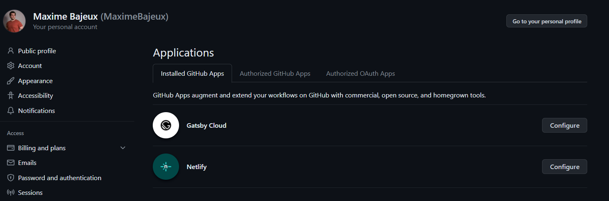

Voilà quelques temps que je travaille à un projet de création de site internet à la volée. A cet exercice, j’ai eu l’idée de me servir de Netlify pour héberger mes sites statiques. Qui dit création de site à la volée dit automatisation, et il était hors de question évidemment de se servir de l’UI de ce dernier. Je me suis donc servi des API de Github et Netlify afin de:

- Créer un Repository sur Github
- Push un site dessus
- Déployer le site sur Netlify en y liant le repo

Et c’est parce que cette dernière étape a été particulièrement complexe que je crée cet article, histoire que le temps que j’ai alloué à la recherche d’une solution puisse potentiellement bénéficier à quelqu’un d’autre.

## Créer les différentes ressources

Lorsque je développe ce genre de solution, avant de me lancer dans du beau code bien structuré, je commence toujours par développer des POC des différents points clés de la solution.

### Création du repo Github

J’ai donc, en Go, comme à mon habitude, écrit un petit programme capable d’utiliser l’API Github afin de créer un repo à distance. Le client fonctionne bien, aucun problème.

```js
package main

import (
	"context"
	"fmt"
	"os"

	"github.com/google/go-github/github"
	"github.com/joho/godotenv"
	"golang.org/x/oauth2"
)

type GithubAPI struct {
	Client      *github.Client
	Ctx         context.Context
	AccountName string
}

func NewGithubAPI(token string, accountName string) *GithubAPI {
	ctx := context.Background()
	ts := oauth2.StaticTokenSource(&oauth2.Token{AccessToken: token})
	tc := oauth2.NewClient(ctx, ts)
	client := github.NewClient(tc)

	return &GithubAPI{
		Client:      client,
		Ctx:         ctx,
		AccountName: accountName,
	}
}

func (api *GithubAPI) CreatePrivateRepo(repoName string) (*github.Repository, *github.Response, error) {
	repo := &github.Repository{
		Name:    github.String(repoName),
		Private: github.Bool(false),
	}
	return api.Client.Repositories.Create(api.Ctx, "", repo)
}

func main() {
	err := godotenv.Load()
	if err != nil {
		log.Fatal("Error loading .env file")
	}
	githubToken := os.Getenv("GITHUB_TOKEN")
	githubUsername := os.Getenv("GITHUB_USERNAME")

	githubAPI := NewGithubAPI(
		githubToken,
		githubUsername,
	)

	// Dans mon script j'obtiens normalement le sitename via un prompt
	siteName := "sitename"

	// create new repo
	repo, response, err := githubAPI.CreatePrivateRepo(siteName)
	if err != nil {
		panic(err)
	}

	fmt.Println(repo, response)
}
```

Vient le moment d’y push le code du site internet que l’on veut créer. Pour l’instant je n’ai rien me permettant de le paramétrer, je pusherais donc le code du Hello World Astro.

Ok. Déjà ça, ça ne me semble pas faisable via le client Go. Je sais que c’est possible de le faire directement via l’API, mais comme pour l’instant je ne sais pas encore ce que j’aurais à y envoyer, je me contente de manipuler la cli git via exec à la crade.

```js
func CloneAndCopyFiles(username, repoName, clonedDir string) {
	// Clonage du dépôt via SSH
	cloneURL := fmt.Sprintf("git@github.com:%s/%s.git", username, repoName)

	cloneCmd := exec.Command("git", "clone", cloneURL)
	if output, err := cloneCmd.CombinedOutput(); err != nil {
		log.Fatalf("Failed to clone repository: %s\nOutput: %s", err, output)
	}

	// Copie des fichiers de la seed dans le répertoire cloné
	// ./vanilla est le dir contenant de le Hello World Astro
	vanillaDir := "./vanilla"
	err := CopyDir(vanillaDir, clonedDir)
	if err != nil {
		log.Fatalf("Failed to copy files: %s\n", err)
	}

	// Ajout, commit et push des modifications avec capture des outputs
	if err := os.Chdir(clonedDir); err != nil {
		log.Fatalf("Failed to change directory: %s\n", err)
	}
	defer os.Chdir("..")

	if output, err := exec.Command("git", "add", ".").CombinedOutput(); err != nil {
		log.Fatalf("Failed to add files: %s\nOutput: %s", err, output)
	}

	if output, err := exec.Command("git", "commit", "-m", "Initial commit with Astro seed").CombinedOutput(); err != nil {
		log.Fatalf("Failed to commit: %s\nOutput: %s", err, output)
	}

	if output, err := exec.Command("git", "push", "-u", "origin", "master").CombinedOutput(); err != nil {
		log.Fatalf("Failed to push: %s\nOutput: %s", err, output)
	} else {
		fmt.Printf("Push output: %s\n", output)
	}

	fmt.Println("Changes pushed to repository")
}
```

C’est donc ok pour Github avec ce test, passons à Netlify

### Création du site sur Netlify

En consultant la documentation de Netlify, je me rend compte qu’il existe un client Go pour manipuler l’API. Super ! Ou pas…

Le client est obsolète est n’a jamais de toute façon implémenté la possibilité de lier un repo Github à un site à sa création.

Tant pis, je passerais par l’API !

J’implémente les requêtes dont j’ai besoin, en faisant ça à la lettre par rapport à la documentation OpenAPI, je teste. Le site se crée, le repo ne se lie pas… Que se passe-t-il ?

J’enquête et je me rend compte rapidement que la documentation OpenAPI n’est pas à jour non plus et que je ne suis pas le seul à avoir ce souci de déploiement.

## Un gros problème de documentation

Je ne sais pas depuis quand date les dernières mises à jour des documentations Netlify, le fait est que je n’ai trouvé ma solution nulle part. Ni sur le guide de prise en main de l’API, ni sur la documentation OpenAPI, ni sur les forums. Les diverses solutions données dans les postes d’aide sont toutes obsolètes.

Si je devais produire un avis sur la question, je dirais que Netlify désavoue un peu l’usage de leur API et la conservent juste parce que “C’est cool d’avoir une API publique”.

## La solution pour lier un repo Github

Si vous lisez cet article c’est peut être ce que vous attendez le plus. Comment faire donc pour lier le repo ? Afin de trouver j’ai finement observé ce qui ce passait au niveau de l’UI lors de la création d’un site et voilà ce que j’ai trouvé.

Pour Github, vous avez toujours besoin de votre installation_id que vous pourrez trouver dans l’url Github de l’application Netlify en cliquant sur configure: https://github.com/settings/installations/[installation_id] (cf screenshot)



Vous n’avez plus besoin de deploy_key_id, ni d’utiliser la requête /deploys pour créer une clé de déploiement avant de créer votre site.

Par contre vous avez besoin de votre id de repo avec la clé “id” et non “repo_id” comme spécifié sur le forum, ainsi que de son nom sous la forme “Username/RepoName”. Pour le reste la documentation semble cohérente.

Je vous laisse un bout de code minimaliste, la partie la plus importante est la structure de la payload.

```js
// NetlifyAPI struct pour interagir avec l'API Netlify.
type NetlifyAPI struct {
	PAT            string
	InstallationID int
	HTTPClient     http.Client
	BaseURL        string
	AccountSlug    string
}

type CreateSitePayload struct {
	Name               string             `json:"name"`
	SubDomain          string             `json:"subdomain"`
	ProcessingSettings ProcessingSettings `json:"processing_settings"`
	Repo               RepoPayload        `json:"repo"`
	AccountSlug        string             `json:"account_slug"`
	DefaultHooksData   DefaultHooksData   `json:"default_hooks_data"`
	Env                []string           `json:"env"`
	Plugins            []string           `json:"plugins"`
	CreatedVia         string             `json:"created_via"`
}

type RepoPayload struct {
	Provider       string `json:"provider"`
	InstallationID int    `json:"installation_id"`
	Repo           string `json:"repo"`
	ID             int    `json:"id"`
	Private        bool   `json:"private"`
	Branch         string `json:"branch"`
	Dir            string `json:"dir"`
	Cmd            string `json:"cmd"`
	OwnerType string   `json:"owner_type"`
	Plugins   []string `json:"plugins"`
}

// NewNetlifyAPI crée une nouvelle instance de NetlifyAPI.
func NewNetlifyAPI(pat string, InstallationID int, accountSlug string) *NetlifyAPI {
	return &NetlifyAPI{
		PAT:            pat,
		InstallationID: InstallationID,
		HTTPClient: http.Client{
			Timeout: time.Second * 90, // Maximum de 90 secondes
		},
		BaseURL:     "https://api.netlify.com/api/v1",
		AccountSlug: accountSlug,
	}
}

func (api *NetlifyAPI) NewSitePayload(name, repoPath string) *CreateSitePayload {
	return &CreateSitePayload{
		Name:        name,
		SubDomain:   name,
		AccountSlug: api.AccountSlug,
		ProcessingSettings: ProcessingSettings{
			HTML: HTMLSettings{
				PrettyUrls: true,
			},
		},
		Repo: RepoPayload{
			Provider:       "github",
			InstallationID: api.InstallationID,
			Private:        true,
			Branch:         "master",
			Dir:            "dist/",
			Cmd:            "astro build",
			OwnerType:      "User",
		},
	}
}

// CreateSite effectue une requête pour créer un nouveau site.
func (api *NetlifyAPI) CreateSite(site *CreateSitePayload) (*Site, error) {
	url := fmt.Sprintf("%s/%s/sites", api.BaseURL, api.AccountSlug)
	body, err := json.Marshal(site)
	if err != nil {
		return nil, err
	}

	body, err = api.doPostRequest(url, body)
	if err != nil {
		return nil, err
	}

	fmt.Println(string(body))

	var createdSite Site
	err = json.Unmarshal(body, &createdSite)
	if err != nil {
		return nil, err
	}

	return &createdSite, nil
}

// doPostRequest effectue une requête POST et retourne le corps de la réponse.
func (api *NetlifyAPI) doPostRequest(url string, body []byte) ([]byte, error) {
	req, err := http.NewRequest(http.MethodPost, url, nil)
	if err != nil {
		return nil, err
	}

	req.Header.Set("Authorization", fmt.Sprintf("Bearer %s", api.PAT))
	req.Header.Set("Content-Type", "application/json")

	// set the body to the request if it's not empty
	if len(body) > 0 {
		req.Body = io.NopCloser(bytes.NewReader(body))
	}

	response, err := api.HTTPClient.Do(req)
	if err != nil {
		return nil, err
	}
	defer response.Body.Close()

	return io.ReadAll(response.Body)
}

func main() {
	netlifyToken := os.Getenv("NETLIFY_TOKEN")
	netlifyInstallationIDString := os.Getenv("NETLIFY_INSTALLATION_ID")
	netlifyAccountSlug := os.Getenv("NETLIFY_ACCOUNT_SLUG")
	githubUsername := os.Getenv("GITHUB_USERNAME")
	githubRepoIDstr := os.Getenv("GITHUB_REPO_ID")
	
	githubRepoID, err := strconv.atoi(githubRepoIDstr)
	if err != nil {
		panic(err)
	}

	netlifyInstallationID, err := strconv.Atoi(netlifyInstallationIDString)
	if err != nil {
		panic(err)
	}

	// Dans mon script j'obtiens normalement le sitename via un prompt
	siteName := "sitename"

	netlifyAPI := netlify.NewNetlifyAPI(netlifyToken, netlifyInstallationID, netlifyAccountSlug)
	newSite := netlifyAPI.NewSitePayload(siteName, fmt.Sprintf("%s/%s", githubUsername, siteName))
	newSite.Repo.ID = githubRepoID
	newSite.Repo.Repo = fmt.Sprintf("%s/%s", githubUsername, siteName)

	createdSite, err := netlifyAPI.CreateSite(newSite)
	if err != nil {
		panic(err)
	}
	
	fmt.Println(createdSite)
}
```

N’hésitez pas à me contacter si vous avez des compléments d’information sur le sujet ou des questions. En attendant moi je vous laisse ici et je continue de mon côté à développer ce projet !