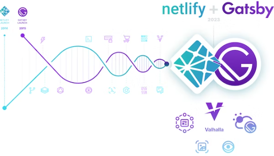

Netlify, plateforme de développement web ayant démocratisé le terme JAMstack dans le monde entier, a annoncé le 1er février avoir acquis Gatsby Inc., créateur du framework javascript éponyme et ayant récemment lancé son Valhalla Content Hub, décrit par eux même comme une “couche de données centralisée”, permettant de brancher n’importe quel framework frontend à leur écosystème de plugins CMS via une API GraphQL unifiée, ce qui était jusqu’alors une exclusivité de leur framework.

## Étendre sa vision

L’acquisition de Gatsby est le dernier mouvement de Netlify pour soutenir sa vision alors que leur solution est utilisée par des entreprises telles que Twilio, Mattel et Verizon ainsi que par plus de 3 millions de développeurs:

> L’avenir du web est des architectures composables. L’acquisition de Gatsby accélère non seulement notre roadmap produit, mais permet surtout de fournir aux développeurs une flexibilité accrue et un choix accru pour construire des expériences web composables.
>
> -- <cite>Matt Biilmann, PDG de Netlify</cite>

Matt Biilmann

> Nous sommes ravis d’intégrer les innovations cloud de Gatsby à la plateforme Netlify et d’ouvrir le Gatsby’s content hub et son écosystème de plugins source au monde diversifié des frameworks frontaux modernes tels qu’Astro, Next et Remix.
>
> -- <cite>Matt Biilmann, PDG de Netlify</cite>

## Le framework à de beaux jours devant lui

Afin de continuer à être drivé par la tech et honorer ses racines profondes dans l’open source, Netlify s’engage à correctement gérer le framework Gatsby. Le co-fondateur de GatsbyJS, Kyle Mathews se veut lui aussi rassurant sur ce sujet, il n’y a donc pas à craindre un arrêt du support de ce framework que nous utilisons au quotidien chez Image IN avant un long moment.

## Une union heureuse

> Après des années de partenariat avec Netlify, nous sommes ravis d’unir nos forces.
>
> -- <cite>Zack Urlocker, PDG de Gatsby</cite>

> Nous partageons une croyance dans l’avenir de l’architecture composable, et ensemble, nous serons mieux en mesure d’apporter notre solution cloud aux équipes d’entreprise et d’accélérer l’adoption de composable.
>
> -- <cite>Zack Urlocker, PDG de Gatsby</cite>

Nous aussi nous croyons à l’avenir de l’architecture composable en tant qu’évolution directe de la JAMstack, Jamais il n’a été aussi élégant de faire des sites internet qui soient à la fois performant et utilisables par n’importe qui, alors n’hésitez pas à nous contacter si vous avez des questions sur notre méthodologie ou si vous avez besoin d’un site performant.
